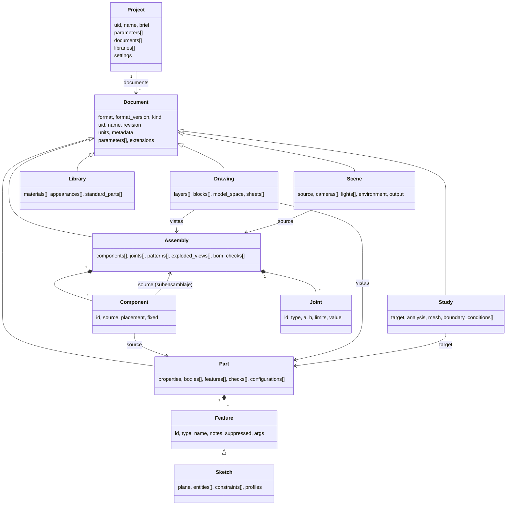

# IACad — Modelo de datos y formato `.iacad`

> Cómo se almacenan los diseños creados con IACad.
> Documentos relacionados: [Requisitos](Requisitos.md) · [Planning](Planning.md) · [Recomendaciones](Recomendaciones.md)
>
> Versión del formato descrita: **1.0 (borrador)** · Fecha: 2026-09-26

---

## 1. Objetivos del modelo

| Objetivo | Cómo se consigue |
|---|---|
| Texto plano, legible por humanos y por LLMs | JSON UTF-8 con nombres de campo descriptivos en `snake_case` |
| Fuente de verdad paramétrica | Se guarda el **historial de operaciones** (features) y sus parámetros, no la malla |
| Determinista y apto para git | Serialización canónica: orden de claves fijo e indentación estable |
| Validable | JSON Schema 2020-12 generado desde modelos Pydantic v2 |
| Robusto frente a ediciones | Referencias topológicas persistentes, cardinalidad `expect` y huellas geométricas |
| Extensible | Sección `extensions` por plugin, que se conserva aunque el plugin no esté instalado |
| Escalable | Un documento por archivo, referencias entre documentos, instancias y patrones virtuales, caché externa |
| Auditable | Journal JSONL separado, con hashes de cada revisión |

**Regla fundamental:** en el `.iacad` solo se guardan **datos de definición**. Todo lo derivado (B-Rep, mallas, resultados de simulación, renders) vive en la caché o en `out/`, y puede borrarse y regenerarse.

---

## 2. Visión general



Tipos de documento (`kind`):

| `kind` | Contiene |
|---|---|
| `project` | Manifiesto: brief/requisitos, parámetros globales, lista de documentos, librerías, ajustes |
| `part` | Pieza: parámetros, cuerpos, timeline de features (sketches, datums, operaciones sólidas), checks |
| `assembly` | Componentes (piezas o subensamblajes), uniones, patrones, vistas explosionadas, BOM |
| `drawing` | Dibujo 2D libre (espacio modelo) y hojas con vistas de piezas o ensamblajes, cotas y anotaciones |
| `study` | Definición de una simulación (FEA, térmica, cinemática) |
| `scene` | Definición de un render (cámaras, luces, entorno, salida) |
| `library` | Materiales, apariencias y piezas estándar reutilizables |

---

## 3. Formato físico y reglas de serialización

- **Extensión:** `.iacad` para todos los tipos. El tipo lo indica el campo `kind`.
- **Codificación:** JSON (RFC 8259), UTF-8 sin BOM, saltos de línea LF y salto final.
- **Canonicalización** (la aplica siempre la herramienta al guardar):
  - Indentación de 2 espacios.
  - Orden de claves: el definido por el esquema; dentro de `extensions`, alfabético.
  - Los arrays cortos de números (vectores y puntos) se escriben en una línea: `[0, -25, 0]`.
  - Sin `NaN` ni `Infinity`; `-0` se normaliza a `0`.
  - Los números calculados (huellas) se redondean a 9 cifras significativas. Los valores escritos por el usuario o el agente se conservan tal cual.
  - Los campos opcionales con valor por defecto se omiten.
- **¿Por qué JSON y no YAML?** Tipado estricto, JSON Schema nativo, los argumentos de las herramientas MCP ya son JSON, parsers rápidos y sin ambigüedades de indentación. Para escribir a mano está el lenguaje de scripts `.iacs` (ver [Planning §4.4](Planning.md)); los comentarios se sustituyen por los campos `description` y `notes`.
- **Tamaño:** se recomienda que un documento no pase de ~1 MB. Los modelos grandes se dividen en varios documentos y se referencian entre sí.

---

## 4. Estructura de un proyecto en disco

```
mi_proyecto/
  proyecto.iacad              # kind: project (manifiesto)
  parts/        soporte.iacad, eje.iacad
  assemblies/   conjunto.iacad
  drawings/     soporte_plano.iacad
  studies/      soporte_estatico.iacad
  scenes/       presentacion.iacad
  libraries/    materiales.iacad
  scripts/      soporte_nema17.iacs
  assets/       geometría importada, inmutable (p. ej. motor.step) + assets.json con hashes
  journal/      2026-09-26_ses_01JB….jsonl   # auditoría (versionable)
  out/          exportaciones, renders, informes, resultados de estudios
  .iacad/       # recomendado en .gitignore
    cache/      BREP, teselados y mapas de nombres por hash
    revisions/  snapshots para undo y checkpoints
    state.json  último hash conocido de cada documento (detecta ediciones externas)
    locks/
```

---

## 5. Tipos comunes

### 5.1 Identificadores
| Tipo | Formato | Uso |
|---|---|---|
| `Id` | `^[a-z][a-z0-9_]{0,62}$` | Features, cuerpos, componentes, uniones, vistas… Único dentro del documento. **Legible** y elegido por el agente (`cuerpo`, `taladros_motor`); si no se da, se genera (`extrude_1`). |
| `SubId` | `Id` + `.` + `Id` | Entidades hijas: `perfil.p` (polilínea `p` del sketch `perfil`), `perfil.p.s3` (tercer segmento). |
| `Uid` | ULID (26 caracteres) | Identidad global del documento, estable aunque se renombre o se mueva el archivo. |
| `ParamName` | `^[A-Za-z_][A-Za-z0-9_]*$` | Parámetros. |

### 5.2 Cantidades y expresiones (`Quantity`)
Un valor puede ser:
- **número**: en las unidades del documento (`5` significa 5 mm si `length = mm`);
- **cadena con unidades**: `"5 mm"`, `"45 deg"`, `"2.7 g/cm^3"`;
- **expresión**: `"espesor * 2 + 1 mm"`, `"sqrt(a^2 + b^2)"`, `"project.holgura"`.

Gramática de expresiones: `+ - * / ^ ( )`, funciones `sin cos tan asin acos atan atan2 sqrt abs min max round floor ceil`, constante `pi`, unidades de Pint y referencias a parámetros. Se evalúa con un intérprete propio y seguro (**nunca** con `eval`). Se comprueba la **coherencia dimensional**: sumar longitud y ángulo da el error `UNIT_MISMATCH`.

### 5.3 Vectores
`Vec2 = [Quantity, Quantity]` y `Vec3 = [Quantity, Quantity, Quantity]`, en coordenadas del documento o del plano, según el contexto.

### 5.4 Planos y colocaciones (`Placement`)
Forma canónica: un sistema de coordenadas completo y sin ambigüedad.

```json
{ "origin": [0, 0, 0], "x_dir": [1, 0, 0], "z_dir": [0, 0, 1] }
```

`y_dir = z_dir × x_dir`, y la herramienta valida que los ejes sean ortonormales. Los comandos también aceptan azúcar sintáctico (`translate` + `rotate: {axis, angle}`, cuaternión o Euler con orden explícito), pero **siempre se guarda en forma canónica**.

**Planos estándar** (convención igual a build123d; se documenta de forma explícita porque los LLM suelen fallar aquí):

| Nombre | origin | x_dir (u) | y_dir (v) | z_dir (normal) |
|---|---|---|---|---|
| `XY` | 0,0,0 | +X | +Y | +Z |
| `XZ` | 0,0,0 | +X | **+Z** | **−Y** |
| `YZ` | 0,0,0 | +Y | +Z | +X |

Variantes: `"-XY"` (normal invertida), `{"base": "XY", "offset": "10 mm"}`, `{"on": <Selection de cara plana>, "offset": "0 mm", "x_dir": [1,0,0]}` o un `Placement` completo.

### 5.5 Referencias y selecciones (`Selection`)
Objeto usado donde una operación necesita caras, aristas, vértices o cuerpos:

```json
{
  "refs":  ["@cuerpo/face:end"],
  "query": { "scope": "principal", "kind": "edge", "where": "|Z and >X", "created_by": "cuerpo" },
  "expect": "one",
  "fingerprints": [ { "type": "plane", "normal": [0, 0, 1], "centroid": [25, 0, 55], "area": 250 } ]
}
```

- Se usa **`refs` o `query`**, no las dos.
- **`expect`** es obligatorio en el formato canónico: `"one"`, `"at_least_one"`, un entero `N` o un rango `"2..4"`. Si no se cumple, la validación L2 falla con `SELECTION_COUNT`.
- **`fingerprints`** los mantiene la herramienta tras cada regeneración correcta. Sirven para detectar derivas y reasignar referencias (aviso `REF_REMAPPED`).
- **Forma abreviada** (aceptada en comandos y scripts): `"@cuerpo/face:end"` equivale a `refs`; `"?principal/edges[|Z and >X]"` equivale a `query`.

**Nombres persistentes** (`@<feature>/<kind>:<rol>[(<origen>)][#<instancia>][~<fragmento>]`):

| Feature | Caras generadas |
|---|---|
| `box` | `xmin xmax ymin ymax zmin zmax` |
| `cylinder` | `side top bottom` |
| `extrude` | `start`, `end`, `side(<sketch>.<entidad>)` |
| `revolve` | `rev(<entidad>)`, `start`, `end` (si el giro no es completo) |
| `fillet` / `chamfer` | `fillet(<nombre de la arista>)` / `chamfer(…)` |
| `hole` | `wall(<i>)`, `bottom(<i>)`, `cbore_wall(<i>)`, `cbore_floor(<i>)`, `csink(<i>)` |
| `shell` | `inner(<cara original>)` |
| patrones y `mirror` | nombre original + `#k` / `mirror(<original>)` |
| booleanas | las caras conservan el nombre de la feature de origen (historial `Modified/Generated`) |

- **Aristas**: unión de las dos caras adyacentes, en orden alfabético: `@cuerpo/edge:side(perfil.p.s3)&side(perfil.p.s4)`.
- **Vértices**: las tres caras adyacentes.
- Si una operación posterior parte una cara en varias, se añade `~1`, `~2`… con un orden determinista, y se avisa con `REF_SPLIT` si alguna selección apuntaba a ella.

**Mini-lenguaje `where`** (se toma de CadQuery porque los LLM ya lo conocen, con extensiones):
- `>Z` / `<Z`: máximo o mínimo en el eje. `>Z[1]`: índice tras ordenar.
- `|Z`: paralelo al eje. `#Z`: perpendicular.
- `+Z` / `-Z`: normal en el mismo sentido o en el contrario.
- `%PLANE`, `%CYLINDER`, `%LINE`, `%CIRCLE`: tipo de geometría.
- Operadores `and`, `or`, `not`, `exc`.
- Extensiones: `radius=2.5`, `radius<3`, `area>100`, `length>=10`, `near(x,y,z)`, `in_box(x0,y0,z0,x1,y1,z1)`, `tag:nombre`.

### 5.6 Otros tipos
- `Color`: `"#RRGGBB"` o `"#RRGGBBAA"`.
- `DocRef`: `{ "doc": "../parts/soporte.iacad", "uid": "01JB…", "configuration": "m" }` (ruta relativa + UID para detectar movimientos).
- `Metadata`: `{ description, author, created, modified, tool_version, tags[] }` (fechas ISO 8601 UTC).
- `notes`: texto libre de **intención de diseño** en features y componentes. Es clave para que otra sesión del agente entienda el porqué.
- `extensions`: `{ "<plugin_id>": { … } }`.

---

## 6. Cabecera común de documento

```json
{
  "format": "iacad",
  "format_version": "1.0",
  "kind": "part",
  "uid": "01JB2X7R9QK4M8N6P3S5T7V9W1",
  "name": "Soporte NEMA17",
  "revision": 7,
  "units": { "length": "mm", "angle": "deg", "mass": "g" },
  "metadata": { "description": "…", "author": "agente:opencode", "created": "…", "modified": "…", "tool_version": "iacad 0.3.0", "tags": [] },
  "parameters": [],
  "extensions": {}
}
```

`revision` aumenta con cada transacción confirmada. Se usa para la concurrencia optimista (`expected_revision`), para el visor y para el journal.

---

## 7. Parámetros y configuraciones

```json
"parameters": [
  { "name": "espesor", "value": "5 mm", "min": "3 mm", "max": "10 mm", "group": "general", "description": "Espesor de placas" },
  { "name": "z_motor", "value": "espesor + 25 mm", "description": "Altura del eje del motor" }
],
"configurations": [
  { "id": "m", "name": "Tamaño M", "overrides": { "largo": "50 mm" } },
  { "id": "l", "name": "Tamaño L", "overrides": { "largo": "80 mm" } }
],
"active_configuration": "m"
```

- Los parámetros del proyecto se referencian como `project.<nombre>`.
- En la implementación actual, `kind: "length"` es el valor por defecto de cada parámetro; `kind: "angle"` declara ángulos (por ejemplo `{"name":"giro","value":"90 deg","kind":"angle"}`). Los `params` devuelven `parameters_mm` y `parameters_deg`. La referencia `project.<nombre>` sigue pendiente; consultar [Estado.md](Estado.md).
- No se permiten ciclos (error `PARAM_CYCLE`). `min` y `max` se validan al evaluar (`PARAM_OUT_OF_RANGE`).
- Cambiar un parámetro no requiere reescribir features: la regeneración propaga el cambio.

---

## 8. Pieza (`kind: part`)

```json
{
  "…cabecera…": "",
  "properties": { "part_number": "SOP-01", "material": "pla", "appearance": "pla_gris" },
  "bodies": [ { "id": "principal", "material": "pla", "appearance": "pla_gris", "export": true } ],
  "features": [ ],
  "checks": [ ],
  "configurations": [ ]
}
```

### 8.1 Feature (campos comunes)
| Campo | Tipo | Oblig. | Descripción |
|---|---|---|---|
| `id` | Id | sí | Único en el documento |
| `type` | string | sí | Tipo registrado (núcleo o plugin: `plugin_id:tipo`) |
| `name` | string | no | Nombre legible |
| `notes` | string | no | Intención de diseño |
| `suppressed` | bool | no | Excluida de la regeneración |
| `args` | objeto | sí | Argumentos específicos del tipo, validados por su esquema |
| `tags` | string[] | no | Etiquetas usables en selectores (`tag:…`) |
| `extensions` | objeto | no | Datos de plugins |

`features` es una **lista ordenada (timeline)**. Una feature solo puede referenciar a las anteriores. El DAG de dependencias se deriva de las referencias.

### 8.2 Catálogo de features
| Grupo | Tipos | Fase |
|---|---|---|
| Referencia | `datum_plane`, `datum_axis`, `datum_point`, `datum_cs` | 2 |
| Croquis | `sketch` | 2 |
| Primitivas | `box`, `cylinder`, `sphere`, `cone`, `torus`, `wedge`, `prism` | 1 |
| Basadas en croquis | `extrude`, `revolve`, `sweep`, `loft`, `helix`, `rib` | 2 |
| Acabado | `fillet`, `chamfer`, `shell`, `draft`, `thicken`, `offset_face` | 2 |
| Taladros y roscas | `hole` (simple, avellanado, rebaje; tablas normalizadas), `thread` (cosmética o modelada) | 2 |
| Booleanas | `boolean` (union, cut, intersect), `split` | 1–2 |
| Transformación y patrón | `move`, `mirror`, `pattern_linear`, `pattern_circular`, `pattern_path`, `pattern_points` | 1–2 |
| Otros | `text` (grabado o relieve), `import_body` (asset), `std_part` (librería), `script` (sandbox, **desactivado por defecto**) | 2–6 |

### 8.3 Sketch
```json
{
  "id": "perfil", "type": "sketch",
  "args": {
    "plane": "XZ",
    "offset": "0 mm",
    "entities": [
      { "id": "p",  "type": "polyline", "closed": true, "points": [[0, 0], ["largo", 0], ["largo", "espesor"]] },
      { "id": "c1", "type": "circle", "center": [10, 10], "radius": "d/2" },
      { "id": "a1", "type": "arc", "center": [0, 0], "radius": 5, "start_angle": "0 deg", "end_angle": "90 deg" },
      { "id": "r1", "type": "rectangle", "center": [0, 0], "width": 20, "height": 10, "angle": "0 deg" },
      { "id": "e1", "type": "line", "start": [0, 0], "end": [10, 0], "construction": true },
      { "id": "k1", "type": "point", "at": [5, 5] }
    ],
    "constraints": [
      { "type": "horizontal", "a": "e1" },
      { "type": "distance", "a": "e1.start", "b": "e1.end", "value": "10 mm" }
    ],
    "profiles": "auto"
  }
}
```
- **Entidades**: `point`, `line`, `arc` (centro y ángulos, o 3 puntos), `circle`, `ellipse`, `polyline`, `rectangle`, `slot`, `polygon` (regular), `spline`, `text`. Todas admiten `construction: true`.
- **Macros** (`polyline`, `rectangle`, `slot`, `polygon`) generan subentidades con IDs deterministas: `p.s1…p.sN` (segmentos; `sN` cierra el contorno), `r1.e1…e4` (abajo, derecha, arriba, izquierda).
- **Subpuntos**: `.start`, `.end`, `.center`, `.mid`.
- **Restricciones** (Fase posterior, solver PlaneGCS): `coincident`, `horizontal`, `vertical`, `parallel`, `perpendicular`, `tangent`, `equal`, `concentric`, `midpoint`, `symmetric`, `fix`, `distance`, `angle`, `radius`, `diameter`. En el MVP la geometría se define con coordenadas paramétricas explícitas.
- **`profiles`**: `"auto"` toma los contornos cerrados con la regla par-impar (exterior con huecos). También se pueden listar de forma explícita: `[{ "id": "ext", "outer": ["p"], "holes": ["c1"] }]`.
- **`offset`**: distancia opcional en unidades de longitud sobre la normal del plano base (XY: +Z, XZ: −Y, YZ: +X); se puede expresar como parámetro. El loft implementado une solo secciones del mismo tipo de plano, con offsets estrictamente ordenados.

### 8.4 Argumentos de las features principales
```jsonc
// extrude
{ "profile": "perfil",                        // sketch, perfil explícito o lista
  "extent": { "type": "distance", "distance": "10 mm" },
  //  | {"type":"symmetric","distance":…} | {"type":"two_sides","d1":…,"d2":…}
  //  | {"type":"to_face","face":<Selection>} | {"type":"through_all"}
  "direction": "normal",                      // normal | reverse | Vec3
  "taper": "0 deg",
  "op": "new_body",                           // new_body | join | cut | intersect
  "body": "principal",                        // con new_body
  "target": "principal" }                     // con join, cut o intersect

// revolve
{ "profile": "perfil", "axis": { "origin": [0,0,0], "dir": [0,0,1] } /* o Selection de arista o datum */,
  "angle": "360 deg", "op": "new_body", "body": "eje" }

// loft (implementado para croquis paralelos XY/XZ/YZ con offset ordenado)
{ "sections": ["base", "corona"], "ruled": true,
  "op": "new_body", "body": "principal" }  // o join/cut/intersect con target

// sweep (implementado para polilínea global; primer tramo normal al croquis)
{ "profile": "seccion", "path": {"points": [[0,0,0],[0,0,10],[20,0,10]],
    "transition": "right"}, "op": "new_body", "body": "principal" }

// fillet / chamfer
{ "edges": <Selection>, "radius": "2 mm" }
{ "edges": <Selection>, "distance": "1 mm", "distance2": null, "angle": null }

// hole
{ "target": "principal",
  "positions": ["pos_motor.t1", "pos_motor.t2"],   // puntos de sketch; la dirección es la normal del sketch
  "kind": "simple",                                 // simple | counterbore | countersink
  "diameter": "3.4 mm",
  "depth": { "type": "through_all", "both_sides": true },   // o {"type":"distance","distance":…}
  "cbore_diameter": null, "cbore_depth": null, "csink_diameter": null, "csink_angle": "90 deg",
  "standard": { "fastener": "ISO 4762", "size": "M3", "fit": "normal" } }   // opcional: calcula los diámetros

// shell
{ "target": "principal", "remove_faces": <Selection>, "thickness": "2 mm", "direction": "inward" }

// pattern_linear (MVP implementado: repite un cuerpo-herramienta sobre un destino)
{ "source": "broca", "target": "principal", "op": "cut", "count": 4,
  "spacing": "12 mm", "direction": [1,0,0], "keep_tool": false }

// pattern_circular (implementado: cuerpo-herramienta; 360° sin copia duplicada)
{ "source": "broca", "target": "principal", "op": "cut", "count": 4,
  "axis": {"origin": [0,0,0], "dir": [0,0,1]}, "angle": "360 deg", "keep_tool": false }

// patrones de features arbitrarias (planeados)
{ "features": ["taladro"], "direction": [1,0,0], "count": 4, "spacing": "20 mm" }
{ "features": ["taladro"], "axis": { "origin": [0,0,0], "dir": [0,0,1] }, "count": 6, "angle": "360 deg" }

// boolean
{ "op": "cut", "target": "principal", "tools": ["cuerpo_aux"], "keep_tools": false }
```

### 8.5 Checks (asserts de diseño)
Son "tests" del diseño, guardados en el propio documento y evaluados en cada regeneración:
```json
"checks": [
  { "id": "solido_valido",  "type": "valid_solid", "target": "principal" },
  { "id": "dimensiones",    "type": "assert", "expr": "bbox(principal).z <= 60 mm and bbox(principal).x <= 60 mm" },
  { "id": "masa",           "type": "assert", "expr": "mass(principal) < 40 g" },
  { "id": "espesor_minimo", "type": "min_wall_thickness", "target": "principal", "value": "3 mm", "severity": "warning" }
]
```
- Funciones disponibles en `expr`: `bbox(x).x|y|z|min|max`, `volume(x)`, `area(x)`, `mass(x)`, `com(x)`, `count(<selector>)`, `distance(a,b)` y los parámetros.
- `severity`: `error` (por defecto; hace fallar `validate` pero **no** revierte la transacción) o `warning`.
- `requirement`: ID opcional de un requisito del brief (trazabilidad).

---

## 9. Ensamblaje (`kind: assembly`)

```json
{
  "…cabecera…": "",
  "components": [
    { "id": "base",  "source": { "doc": "../parts/base.iacad", "uid": "01JB…" }, "placement": { "origin": [0,0,0], "x_dir": [1,0,0], "z_dir": [0,0,1] }, "fixed": true },
    { "id": "brazo", "source": { "doc": "../parts/brazo.iacad" }, "placement": { "origin": [0,0,40], "x_dir": [0,1,0], "z_dir": [0,0,1] }, "notes": "Gira sobre el eje de la base" },
    { "id": "tornillo", "source": { "library": "bd_warehouse", "part": "SocketHeadCapScrew",
        "params": { "size": "M3-0.5", "length": "10 mm", "fastener_type": "iso4762" } },
      "placement": { "origin": [10,10,5], "x_dir": [1,0,0], "z_dir": [0,0,1] },
      "pattern": { "type": "linear", "count": [2, 2], "spacing": ["31 mm", "31 mm"], "directions": [[1,0,0],[0,1,0]] } }
  ],
  "joints": [
    { "id": "bisagra", "type": "revolute",
      "a": { "component": "base",  "frame": { "on": "@taladro/face:wall(1)", "mode": "axis_center" } },
      "b": { "component": "brazo", "frame": { "origin": [0,0,0], "x_dir": [1,0,0], "z_dir": [0,0,1] } },
      "limits": { "min": "-90 deg", "max": "90 deg" }, "value": "30 deg" }
  ],
  "exploded_views": [ { "id": "explosion", "steps": [ { "components": ["brazo"], "translate": [0, 0, 50] } ] } ],
  "bom": { "group_by": "source", "columns": ["item", "part_number", "description", "qty", "material"] },
  "checks": [ { "id": "sin_interferencias", "type": "no_interference", "scope": "all", "tolerance": "0.01 mm" } ]
}
```

- **Tipos de unión**: `rigid`, `revolute`, `slider`, `cylindrical`, `planar`, `ball`, `pin_slot`. `value` es el estado actual del grado de libertad.
- **`placement`** guarda el último estado resuelto (carga rápida y diffs legibles). Si el componente está gobernado por uniones, el solver lo recalcula.
- **Escalabilidad**: `pattern` genera instancias **virtuales**, sin una entrada JSON por instancia. Todas las instancias de un mismo `source` comparten geometría en caché y se exportan como instancias (STEP XCAF con referencias compartidas, GLB con instancing).
- **Subensamblajes**: `source.doc` puede apuntar a otro ensamblaje.
- Referencias desde el ensamblaje a la geometría de un componente: `<componente>:<nombre persistente>`, por ejemplo `brazo:@cuerpo/face:end`.

---

## 10. Plano y dibujo 2D (`kind: drawing`)

Unifica el **dibujo 2D libre** (estilo AutoCAD, en `model_space`) y los **planos derivados del 3D** (en `sheets`).

```json
{
  "…cabecera…": "",
  "standard": "ISO", "projection": "first_angle",
  "layers": [
    { "name": "0", "color": "#000000", "linetype": "CONTINUOUS", "lineweight": 0.25 },
    { "name": "OCULTAS", "color": "#555555", "linetype": "HIDDEN", "lineweight": 0.18 },
    { "name": "COTAS", "color": "#0000FF", "linetype": "CONTINUOUS", "lineweight": 0.18 }
  ],
  "blocks": [ { "id": "marca", "base_point": [0,0], "entities": [ { "type": "circle", "center": [0,0], "radius": 2 } ] } ],
  "model_space": {
    "entities": [
      { "id": "l1", "type": "line", "layer": "0", "start": [0,0], "end": [100,0] },
      { "id": "h1", "type": "hatch", "layer": "0", "boundary": ["l1", "l2", "l3", "l4"], "pattern": "ANSI31", "scale": 1 },
      { "id": "i1", "type": "insert", "block": "marca", "at": [50, 20], "rotation": "0 deg", "scale": 1 },
      { "id": "d1", "type": "dim_linear", "layer": "COTAS", "p1": [0,0], "p2": [100,0], "offset": -10 }
    ]
  },
  "sheets": [
    { "id": "hoja1", "size": "A3", "orientation": "landscape", "scale": "1:1",
      "title_block": { "template": "iso7200", "fields": { "title": "Soporte NEMA17", "drawn_by": "IA", "date": "2026-09-26", "material": "PLA" } },
      "views": [
        { "id": "alzado", "type": "base", "source": { "doc": "../parts/soporte.iacad" }, "orientation": "front", "position": [120, 170], "hidden_lines": true },
        { "id": "planta", "type": "projected", "parent": "alzado", "direction": "down",  "position": [120, 70] },
        { "id": "perfil", "type": "projected", "parent": "alzado", "direction": "right", "position": [260, 170] },
        { "id": "iso",    "type": "base", "source": { "doc": "../parts/soporte.iacad" }, "orientation": "iso", "scale": "1:2", "position": [340, 70] },
        { "id": "corte_a", "type": "section", "parent": "alzado", "cut": { "points": [[0, 30], [50, 30]] }, "label": "A-A", "position": [260, 70] },
        { "id": "det_b",  "type": "detail", "parent": "alzado", "center": [5, 5], "radius": 8, "scale": "4:1", "label": "B", "position": [60, 250] }
      ],
      "annotations": [
        { "id": "c1", "type": "dim_linear", "view": "alzado", "a": "@cuerpo/edge:side(perfil.p.s1)&side(perfil.p.s6)", "b": "@cuerpo/edge:side(perfil.p.s1)&side(perfil.p.s2)", "offset": -12 },
        { "id": "c2", "type": "dim_diameter", "view": "perfil", "ref": "@taladro_centro/edge:wall(1)&side(perfil.p.s6)" },
        { "id": "n1", "type": "note", "at": [20, 20], "text": "Tolerancias generales ISO 2768-m" },
        { "id": "t1", "type": "bom_table", "at": [300, 250] }
      ] }
  ]
}
```

Entidades 2D: `point`, `line`, `arc`, `circle`, `ellipse`, `polyline`, `spline`, `text`, `mtext`, `hatch`, `insert`. Cotas: `dim_linear`, `dim_aligned`, `dim_angular`, `dim_radius`, `dim_diameter`, `dim_ordinate`. Anotaciones: `note`, `leader`, `gdt` (tolerancias geométricas), `surface_finish`, `balloon`, `bom_table`, `hole_table`.

---

## 11. Librería: materiales y apariencias (`kind: library`)

```json
{
  "…cabecera…": "",
  "materials": [
    { "id": "al_6061_t6", "name": "Aluminio 6061-T6", "density": "2.70 g/cm^3", "youngs_modulus": "68.9 GPa",
      "poisson_ratio": 0.33, "yield_strength": "276 MPa", "ultimate_strength": "310 MPa",
      "thermal_conductivity": "167 W/(m*K)", "thermal_expansion": "23.6e-6 1/K", "appearance": "aluminio_satinado",
      "source": "valores de referencia típicos; verificar con el proveedor" },
    { "id": "pla", "name": "PLA (impresión FDM)", "density": "1.24 g/cm^3", "youngs_modulus": "3.5 GPa",
      "poisson_ratio": 0.36, "yield_strength": "50 MPa", "appearance": "pla_gris",
      "source": "valores de referencia típicos; varían según impresión" }
  ],
  "appearances": [
    { "id": "aluminio_satinado", "base_color": "#C8C8CC", "metallic": 1.0, "roughness": 0.35 },
    { "id": "pla_gris", "base_color": "#8A8D91", "metallic": 0.0, "roughness": 0.6 }
  ],
  "standard_parts": [
    { "id": "tornillo_m3x10", "library": "bd_warehouse", "part": "SocketHeadCapScrew", "params": { "size": "M3-0.5", "length": "10 mm", "fastener_type": "iso4762" } }
  ]
}
```

Se incluye una librería integrada, `iacad:std/materials`. El proyecto declara qué librerías usa en `libraries`.

---

## 12. Estudio de simulación (`kind: study`)

```json
{
  "…cabecera…": "",
  "target": { "doc": "../parts/soporte.iacad" },
  "analysis": { "type": "static_linear", "solver": "calculix" },
  "materials": [ { "bodies": ["principal"], "material": "pla" } ],
  "mesh": { "mesher": "gmsh", "element_order": 2, "max_size": "3 mm",
            "refinements": [ { "faces": { "refs": ["@redondeo_interior/face:fillet(…)"], "expect": "one" }, "size": "0.8 mm" } ] },
  "boundary_conditions": [
    { "id": "empotramiento", "type": "fixed",  "faces": { "refs": ["@cuerpo/face:side(perfil.p.s1)"], "expect": "one" } },
    { "id": "carga_motor",   "type": "force",  "faces": { "query": { "scope": "principal", "kind": "face", "where": "%CYLINDER and radius=1.7" }, "expect": 4 }, "vector": ["0 N", "0 N", "-5 N"] },
    { "id": "gravedad",      "type": "gravity", "vector": [0, 0, "-9.81 m/s^2"] }
  ],
  "outputs": ["von_mises", "displacement", "safety_factor"],
  "acceptance": [ { "expr": "min(safety_factor) >= 2", "requirement": "REQ-3" } ]
}
```

Tipos de análisis: `static_linear`, `modal`, `thermal_steady`, `buckling`, `kinematic_sweep`, `rigid_dynamics` (MuJoCo). Los **resultados no se guardan en el documento**: van a `out/studies/<id>/run_<n>/` con `results.json` (resumen: máximos, mínimos, criterios de aceptación), mallas y PNG.

---

## 13. Escena de render (`kind: scene`)

```json
{
  "…cabecera…": "",
  "source": { "doc": "../assemblies/conjunto.iacad", "exploded_view": null },
  "cameras": [
    { "id": "principal", "type": "perspective", "position": [300, -300, 200], "target": [0, 0, 40], "fov": "35 deg" },
    { "id": "iso", "preset": "iso" }
  ],
  "lights": [ { "id": "key", "type": "area", "position": [200, -200, 300], "power": "500 W", "size": "0.5 m" } ],
  "environment": { "type": "hdri", "file": "assets/studio.hdr", "strength": 1.0 },
  "overrides": [ { "target": "brazo", "appearance": "plastico_rojo" } ],
  "output": { "engine": "blender_cycles", "resolution": [1920, 1080], "samples": 128, "denoise": true, "format": "png", "transparent_background": false },
  "animations": [ { "id": "turntable", "type": "turntable", "frames": 120, "fps": 30 } ]
}
```

---

## 14. Proyecto (`kind: project`)

```json
{
  "format": "iacad", "format_version": "1.0", "kind": "project",
  "uid": "01JB2X6A1B2C3D4E5F6G7H8J9K", "name": "Soporte motor impresora", "revision": 3,
  "units": { "length": "mm", "angle": "deg", "mass": "g" },
  "metadata": { "author": "Bernardo + agente:opencode", "created": "2026-09-26T10:00:00Z" },
  "brief": {
    "summary": "Soporte en L para NEMA17, imprimible en PLA sin soportes",
    "requirements": [
      { "id": "REQ-1", "text": "Alojar motor NEMA17: resalte Ø22 mm, tornillos M3 a 31 mm", "verified_by": ["parts/soporte.iacad#taladros_motor"] },
      { "id": "REQ-2", "text": "Caber en 60×60×60 mm", "verified_by": ["parts/soporte.iacad#check:dimensiones"] },
      { "id": "REQ-3", "text": "Factor de seguridad ≥ 2 con 5 N", "verified_by": ["studies/soporte_estatico.iacad"] }
    ],
    "assumptions": ["Tornillos M5 para fijar la base"],
    "open_questions": []
  },
  "parameters": [ { "name": "holgura", "value": "0.2 mm", "description": "Holgura de impresión" } ],
  "documents": [
    { "path": "parts/soporte.iacad", "kind": "part", "uid": "01JB2X7R9QK4M8N6P3S5T7V9W1" },
    { "path": "drawings/soporte_plano.iacad", "kind": "drawing" },
    { "path": "studies/soporte_estatico.iacad", "kind": "study" }
  ],
  "libraries": ["iacad:std/materials", "libraries/materiales.iacad"],
  "settings": {
    "tolerance": { "linear": "0.001 mm", "angular": "0.01 deg" },
    "journal": { "enabled": true, "path": "journal/" },
    "cache": { "path": ".iacad/cache", "max_size": "2 GB" },
    "security": { "allow_script_features": false, "allowed_paths": ["."], "operation_timeout": "60 s" },
    "exports": { "output_dir": "out/", "default_formats": ["step", "stl"] }
  }
}
```

El **brief** es la memoria del encargo: el agente lo consulta y lo actualiza, y cada requisito se enlaza con los checks o features que lo verifican.

---

## 15. Journal de operaciones (auditoría)

Un archivo JSON Lines por sesión, `journal/<fecha>_<sesión>.jsonl`, append-only. Cada línea es un evento:

```json
{"ts":"2026-09-26T10:15:03.412Z","seq":42,"session":"ses_01JB…","actor":{"type":"agent","client":"opencode","model":"…"},"event":"command","doc":"parts/soporte.iacad","rev_before":7,"rev_after":8,"hash_before":"sha256:ab12…","hash_after":"sha256:cd34…","command":{"cmd":"feature.fillet","args":{"id":"redondeo_interior","edges":"@cuerpo/edge:side(perfil.p.s3)&side(perfil.p.s4)","radius":"4 mm","expect":"one"}},"status":"ok","duration_ms":184,"changes":{"added":["redondeo_interior"],"modified":[],"removed":[]},"warnings":[]}
{"ts":"2026-09-26T10:16:10.020Z","seq":43,"session":"ses_01JB…","actor":{"type":"agent","client":"opencode"},"event":"command","doc":"parts/soporte.iacad","rev_before":8,"rev_after":8,"command":{"cmd":"feature.fillet","args":{"id":"r2","edges":"?principal/edges[|Y and >Z]","radius":"6 mm","expect":2}},"status":"rejected","stage":"geometry","duration_ms":95,"error":{"code":"FILLET_FAILED","path":"args.radius","hint":"Radio mayor que el espesor (5 mm)"}}
{"ts":"2026-09-26T10:30:00.000Z","seq":57,"session":"ses_01JB…","event":"export","doc":"parts/soporte.iacad","rev":12,"format":"step","file":"out/soporte.step","file_hash":"sha256:9f0e…","status":"ok"}
```

- **Eventos**: `session_start`, `session_end`, `doc_open`, `doc_save`, `command`, `undo`, `redo`, `checkpoint`, `export`, `import`, `render`, `analysis`, `external_edit_detected`.
- **`replay`**: aplicar en orden los `command` con `status: ok` reconstruye el documento; al final se compara `hash_after`.
- Todo archivo exportado queda asociado a la **revisión y el hash** que lo produjeron.
- Los logs técnicos (structlog, en stderr y `.iacad/logs/`) son aparte; el journal es el registro de negocio.

---

## 16. Caché y artefactos derivados

- **Clave** = `sha256(JSON canónico de la feature + valores resueltos de parámetros + hashes de las entradas + versión de IACad + versión del kernel)`.
- **Artefactos** en `.iacad/cache/<aa>/<clave>.*`: `.brep` (BREP binario de OCCT), `.glb` (teselado), `.names.json` (mapa de nombres persistentes), `.meta.json` (bbox, volumen, validez).
- Expulsión LRU según `settings.cache.max_size`. La caché **nunca** es fuente de verdad: borrarla solo cuesta tiempo.
- Assets importados (`assets/`): inmutables, identificados por hash en `assets/assets.json`. `import_body` los referencia por ruta + hash; si el hash cambia, se avisa con `ASSET_CHANGED`.

---

## 17. Esquema JSON (extracto)

```json
{
  "$schema": "https://json-schema.org/draft/2020-12/schema",
  "$id": "https://iacad.local/schema/1.0/document.json",
  "type": "object",
  "required": ["format", "format_version", "kind", "uid", "name", "revision", "units"],
  "properties": {
    "format": { "const": "iacad" },
    "format_version": { "type": "string", "pattern": "^1\\.[0-9]+$" },
    "kind": { "enum": ["project", "part", "assembly", "drawing", "study", "scene", "library"] },
    "uid": { "type": "string", "pattern": "^[0-9A-HJKMNP-TV-Z]{26}$" },
    "name": { "type": "string", "minLength": 1, "maxLength": 200 },
    "revision": { "type": "integer", "minimum": 0 },
    "units": { "$ref": "#/$defs/Units" },
    "parameters": { "type": "array", "items": { "$ref": "#/$defs/Parameter" } },
    "features": { "type": "array", "items": { "$ref": "#/$defs/Feature" } },
    "extensions": { "type": "object" }
  },
  "$defs": {
    "Id": { "type": "string", "pattern": "^[a-z][a-z0-9_]{0,62}$" },
    "Quantity": { "oneOf": [ { "type": "number" }, { "type": "string", "minLength": 1 } ] },
    "Units": {
      "type": "object",
      "properties": {
        "length": { "enum": ["mm", "cm", "m", "in", "ft"] },
        "angle": { "enum": ["deg", "rad"] },
        "mass": { "enum": ["g", "kg", "lb"] }
      },
      "required": ["length", "angle"]
    },
    "Parameter": {
      "type": "object", "required": ["name", "value"],
      "properties": {
        "name": { "type": "string", "pattern": "^[A-Za-z_][A-Za-z0-9_]*$" },
        "value": { "$ref": "#/$defs/Quantity" },
        "min": { "$ref": "#/$defs/Quantity" }, "max": { "$ref": "#/$defs/Quantity" },
        "description": { "type": "string" }, "group": { "type": "string" }
      },
      "additionalProperties": false
    },
    "Selection": {
      "type": "object", "required": ["expect"],
      "properties": {
        "refs": { "type": "array", "items": { "type": "string", "pattern": "^@" }, "minItems": 1 },
        "query": { "type": "object", "required": ["scope", "kind", "where"] },
        "expect": { "oneOf": [ { "enum": ["one", "at_least_one"] }, { "type": "integer", "minimum": 1 }, { "type": "string", "pattern": "^[0-9]+\\.\\.[0-9]+$" } ] },
        "fingerprints": { "type": "array" }
      },
      "oneOf": [ { "required": ["refs"] }, { "required": ["query"] } ]
    },
    "Feature": {
      "type": "object", "required": ["id", "type", "args"],
      "properties": {
        "id": { "$ref": "#/$defs/Id" }, "type": { "type": "string" },
        "name": { "type": "string" }, "notes": { "type": "string" },
        "suppressed": { "type": "boolean" }, "tags": { "type": "array", "items": { "type": "string" } },
        "args": { "type": "object" }, "extensions": { "type": "object" }
      },
      "additionalProperties": false
    }
  }
}
```

El esquema completo se **genera** desde los modelos Pydantic, incluidos los `args` de cada tipo de feature mediante un `oneOf` discriminado por `type`. Cada plugin aporta su subesquema. Se publica con `iacad help --schema` y se reutiliza como `inputSchema` de las herramientas MCP: **comando y feature persistida comparten el mismo esquema**.

---

## 18. Versionado del formato y migraciones

- `format_version = MAJOR.MINOR`. Un MINOR añade campos opcionales (compatible). Un MAJOR cambia estructura y requiere migración.
- `iacad migrate <archivo>` encadena migradores (`1.0→1.1→2.0`) y guarda una copia `.bak`.
- Si una versión antigua de la herramienta abre un documento con un MINOR más nuevo, lo abre **en solo lectura** y avisa.
- Los campos desconocidos fuera de `extensions` son un error de validación (modo estricto). Dentro de `extensions` se conservan intactos.

---

## 19. Ejemplo completo: pieza `parts/soporte.iacad`

```json
{
  "format": "iacad",
  "format_version": "1.0",
  "kind": "part",
  "uid": "01JB2X7R9QK4M8N6P3S5T7V9W1",
  "name": "Soporte NEMA17",
  "revision": 12,
  "units": { "length": "mm", "angle": "deg", "mass": "g" },
  "metadata": {
    "description": "Soporte en L para motor paso a paso NEMA17",
    "author": "agente:opencode",
    "created": "2026-09-26T10:02:11Z",
    "modified": "2026-09-26T10:29:40Z",
    "tool_version": "iacad 0.3.0",
    "tags": ["soporte", "nema17", "impresion3d"]
  },
  "properties": { "part_number": "SOP-NEMA17-01", "material": "pla", "appearance": "pla_gris" },
  "parameters": [
    { "name": "espesor", "value": "5 mm", "min": "3 mm", "description": "Espesor de las placas" },
    { "name": "ancho", "value": "50 mm", "description": "Ancho del soporte (eje Y)" },
    { "name": "alto", "value": "55 mm", "description": "Altura de la placa vertical" },
    { "name": "largo", "value": "50 mm", "description": "Longitud de la base (eje X)" },
    { "name": "z_motor", "value": "espesor + 25 mm", "description": "Altura del eje del motor" },
    { "name": "d_centrado", "value": "22.5 mm", "description": "Paso del resalte de centrado Ø22 con holgura" },
    { "name": "paso_m3", "value": "31 mm", "description": "Separación entre tornillos del NEMA17" },
    { "name": "d_m3", "value": "3.4 mm" },
    { "name": "d_m5", "value": "5.5 mm" }
  ],
  "bodies": [ { "id": "principal", "material": "pla", "appearance": "pla_gris" } ],
  "features": [
    {
      "id": "perfil",
      "type": "sketch",
      "notes": "Perfil en L visto de frente (plano XZ: u=X, v=Z)",
      "args": {
        "plane": "XZ",
        "entities": [
          { "id": "p", "type": "polyline", "closed": true,
            "points": [[0, 0], ["largo", 0], ["largo", "espesor"], ["espesor", "espesor"], ["espesor", "alto"], [0, "alto"]] }
        ]
      }
    },
    {
      "id": "cuerpo",
      "type": "extrude",
      "notes": "Cuerpo principal, simétrico respecto al plano XZ",
      "args": { "profile": "perfil", "extent": { "type": "symmetric", "distance": "ancho" }, "op": "new_body", "body": "principal" }
    },
    {
      "id": "pos_motor",
      "type": "sketch",
      "notes": "Posiciones del motor en la placa vertical (plano YZ: u=Y, v=Z)",
      "args": {
        "plane": "YZ",
        "entities": [
          { "id": "c",  "type": "point", "at": [0, "z_motor"] },
          { "id": "t1", "type": "point", "at": ["-paso_m3/2", "z_motor - paso_m3/2"] },
          { "id": "t2", "type": "point", "at": ["paso_m3/2",  "z_motor - paso_m3/2"] },
          { "id": "t3", "type": "point", "at": ["paso_m3/2",  "z_motor + paso_m3/2"] },
          { "id": "t4", "type": "point", "at": ["-paso_m3/2", "z_motor + paso_m3/2"] }
        ]
      }
    },
    {
      "id": "taladro_centro",
      "type": "hole",
      "args": { "target": "principal", "positions": ["pos_motor.c"], "diameter": "d_centrado", "depth": { "type": "through_all", "both_sides": true } }
    },
    {
      "id": "taladros_motor",
      "type": "hole",
      "args": {
        "target": "principal",
        "positions": ["pos_motor.t1", "pos_motor.t2", "pos_motor.t3", "pos_motor.t4"],
        "diameter": "d_m3",
        "depth": { "type": "through_all", "both_sides": true }
      }
    },
    {
      "id": "pos_base",
      "type": "sketch",
      "args": {
        "plane": "XY",
        "entities": [
          { "id": "b1", "type": "point", "at": ["largo - 12 mm", "-15 mm"] },
          { "id": "b2", "type": "point", "at": ["largo - 12 mm", "15 mm"] }
        ]
      }
    },
    {
      "id": "taladros_base",
      "type": "hole",
      "args": { "target": "principal", "positions": ["pos_base.b1", "pos_base.b2"], "diameter": "d_m5", "depth": { "type": "through_all", "both_sides": true } }
    },
    {
      "id": "redondeo_interior",
      "type": "fillet",
      "notes": "Refuerza la unión entre la base y la placa vertical",
      "args": {
        "edges": { "refs": ["@cuerpo/edge:side(perfil.p.s3)&side(perfil.p.s4)"], "expect": "one" },
        "radius": "4 mm"
      }
    },
    {
      "id": "redondeo_superior",
      "type": "fillet",
      "args": {
        "edges": { "query": { "scope": "principal", "kind": "edge", "where": "|Y and >Z" }, "expect": 2 },
        "radius": "2 mm"
      }
    }
  ],
  "checks": [
    { "id": "solido_valido", "type": "valid_solid", "target": "principal" },
    { "id": "dimensiones", "type": "assert", "expr": "bbox(principal).z <= 60 mm and bbox(principal).x <= 60 mm", "requirement": "REQ-2" },
    { "id": "masa", "type": "assert", "expr": "mass(principal) < 40 g" },
    { "id": "espesor_minimo", "type": "min_wall_thickness", "target": "principal", "value": "3 mm", "severity": "warning" }
  ]
}
```

Comprobación rápida del ejemplo:
- Volumen ≈ 25 000 mm³ del perfil en L, menos los taladros (≈2 400 mm³), más y menos los redondeos: **≈ 22 700 mm³**.
- Con PLA a 1,24 g/cm³ son **≈ 28 g**, así que el check `masa` pasa.
- Bbox: 50 × 50 × 55 mm, así que `dimensiones` pasa.
