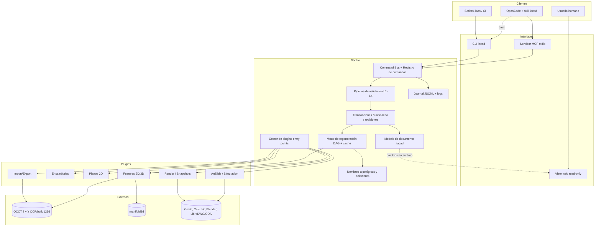
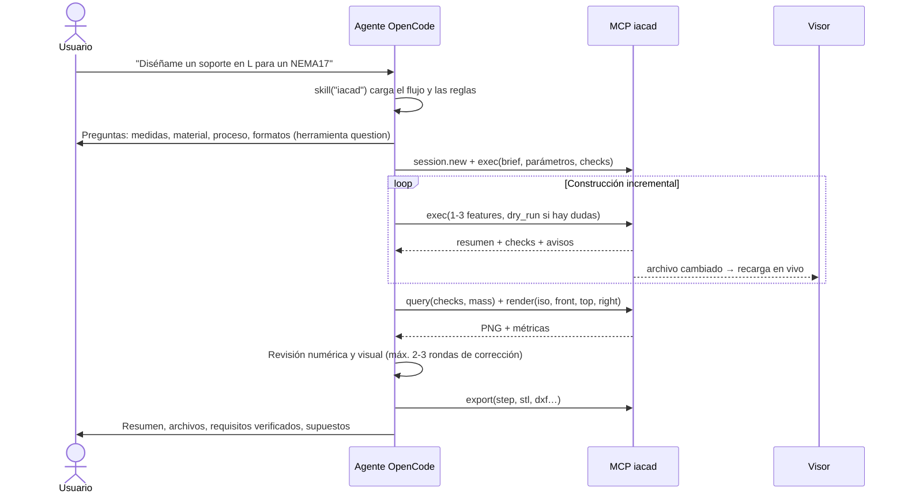
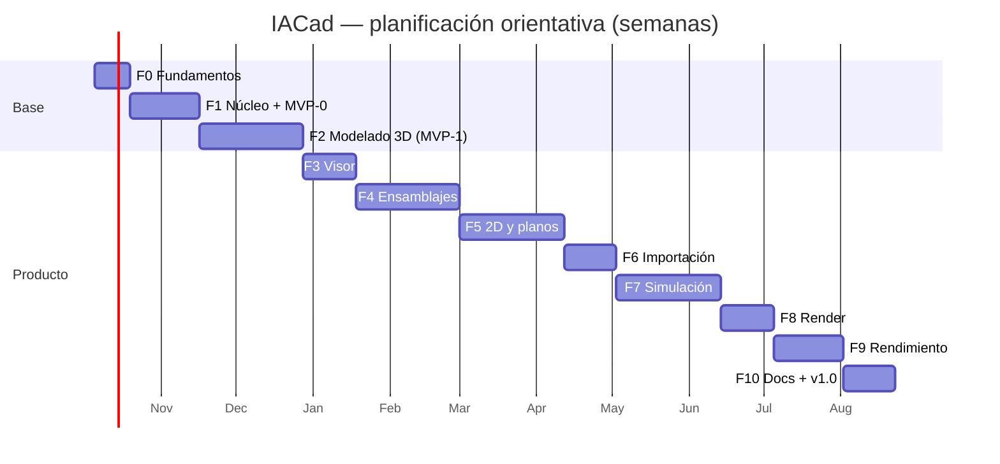

# IACad — Planning del proyecto

> Herramienta CAD **sin interfaz de usuario** (headless), manejada por comandos de texto y scripts, diseñada para que un **agente de IA desde OpenCode** construya los diseños que le pide un usuario.
>
> Documentos relacionados: [Requisitos](Requisitos.md) · [Modelo de datos](Modelo.md) · [Recomendaciones](Recomendaciones.md)
>
> Fecha: 2026-09-26 · Estado: borrador v0.1

---

## 1. Objetivo y alcance

### 1.1 Objetivo
Construir **IACad**, un motor CAD paramétrico headless que:

1. Recibe **comandos y scripts de texto** (CLI y servidor MCP) validados antes de aplicarse.
2. Guarda los diseños en un **formato propio de texto plano** (`.iacad`, JSON canónico), que es la fuente de verdad.
3. Da al agente **información verificable** sobre el modelo: medidas, validez, comprobaciones e imágenes renderizadas.
4. Exporta a los formatos habituales (STEP, STL, 3MF, glTF, DXF, DWG, SVG, PDF…).
5. Incluye un **visor de solo lectura** para que el usuario vea en tiempo real lo que construye la IA.
6. Se entrega con un **skill de OpenCode** (`iacad`) que enseña al agente el flujo de trabajo correcto.

### 1.2 Fuera de alcance
- Cualquier GUI de edición. El visor **nunca** modifica modelos.
- Kernel geométrico propio: se usa Open CASCADE (OCCT).
- Formatos nativos propietarios (SLDPRT, F3D, IPT…), salvo mediante conversores externos en el futuro.
- Colaboración en la nube multiusuario (fase posterior, si llega).

### 1.3 Usuario principal
El **agente de IA**. El humano describe lo que quiere, responde preguntas, mira el visor y revisa los entregables. Todas las decisiones de diseño de la interfaz se optimizan para un LLM: pocas herramientas, respuestas estructuradas y compactas, errores accionables e IDs legibles.

---

## 2. Principios de diseño

| # | Principio | Consecuencia práctica |
|---|---|---|
| P1 | **AI-first** | Pocas herramientas MCP genéricas y documentación bajo demanda. Salida JSON estructurada; errores con código, ruta del argumento y sugerencia. |
| P2 | **El texto es la verdad** | El `.iacad` guarda el *historial paramétrico* (árbol de operaciones). La geometría B-Rep es derivada y se cachea. |
| P3 | **Determinismo** | El mismo archivo + la misma versión del kernel dan la misma geometría. Serialización canónica, apta para `git diff`. |
| P4 | **Transacciones validadas** | Cada comando pasa un pipeline de validación y se aplica todo o nada. Nunca se deja un documento corrupto. |
| P5 | **Verificar, no suponer** | Checks numéricos (bbox, volumen, espesor, interferencias) y asserts guardados en el propio diseño, más renders para revisión visual. |
| P6 | **Modularidad** | Núcleo mínimo. Features, importadores, exportadores, análisis y renderizadores son plugins. |
| P7 | **Auditable** | Cada operación queda en un journal JSONL append-only, con hashes antes/después. |
| P8 | **Local y seguro** | Servidor MCP por stdio, acceso restringido al workspace, sin ejecución de código arbitrario por defecto. |
| P9 | **Portable** | La interfaz principal es MCP (estándar), así que funciona también con otros agentes. La CLI sirve de alternativa universal. |

---

## 3. Decisiones técnicas (resumen de ADRs)

Cada decisión se formalizará como ADR en `doc/adr/` durante la Fase 0.

| ADR | Decisión | Alternativas descartadas / motivo |
|---|---|---|
| 01 Lenguaje | **Python 3.12–3.13**, gestionado con `uv`. Partes críticas en Rust/C++ solo si el profiling lo justifica. | C++ (lento de desarrollar), Rust (kernels inmaduros: Fornjot cerrado, truck 0.x), TS/WASM (opencascade.js estancado). 3.12–3.13 es el rango donde OCP, build123d, manifold3d y planegcs tienen wheels para Windows. |
| 02 Kernel | **OCCT 8.0** vía **OCP**, con **build123d 0.13** (modo *Algebra*) como fachada. Todo detrás de una interfaz propia `KernelAdapter`. **manifold3d** para operaciones de malla. | CadQuery (fijado a OCCT 7.9 y no convive con build123d; sí se copia su sintaxis de selectores). FreeCAD como núcleo (≈0,5 GB, Python 3.11 embebido); se reserva como *worker* opcional. |
| 03 Formato | **`.iacad` = JSON UTF-8 canónico**, validado con JSON Schema 2020-12 generado desde modelos Pydantic v2. Un documento por archivo más un manifiesto de proyecto. | YAML (tipado ambiguo, errores de indentación), DSL propio como formato de almacenamiento (exige parser y no se valida con JSON Schema). Ver [Modelo.md](Modelo.md). |
| 04 Interfaces | Núcleo → **Command Bus** → **CLI `iacad`** (salida JSON) + **servidor MCP stdio `iacad mcp`**. Más adelante, un daemon JSON-RPC opcional. | Solo CLI: sin estado entre llamadas, así que se regenera la geometría en cada una. |
| 05 Scripts | **IACad Script (`.iacs`)**: un comando por línea, equivalente 1:1 a los comandos JSON, con parámetros y expresiones con unidades. Sin código arbitrario. Feature `script` (Python build123d en sandbox) **desactivada por defecto**. | Python libre como lenguaje principal: no se puede validar antes de ejecutar, no produce un árbol persistente y es un riesgo de seguridad. |
| 06 Referencias topológicas | **Nombres persistentes** derivados del historial (`BRepTools_History`; evaluar `BRepGraph` de OCCT 8), **selectores semánticos** estilo CadQuery y **huellas geométricas** con cardinalidad esperada (`expect`). | Índices de caras/aristas: se rompen al cambiar parámetros (el problema de nombres topológicos). |
| 07 Visor | **Web local de solo lectura** (`iacad view`) con three-cad-viewer, GLB + aristas + metadatos y recarga en vivo por WebSocket. El *picking* muestra el ID persistente para que el usuario pueda indicárselo a la IA. Prototipo inicial con `ocp_viewer`. | Visor de escritorio Qt/VTK: más pesado y sin ventaja real. |
| 08 Render | **Blender CLI** (4.5 LTS, subproceso, Cycles) para imágenes fotorrealistas; **PyVista off-screen** para capturas técnicas rápidas del agente. | pyrender (sin mantenimiento desde 2021). |
| 09 Simulación | Plugins: **Gmsh** y **CalculiX** como subprocesos (`.inp`), **scikit-fem** para cálculos rápidos en proceso, **MuJoCo** para cinemática y dinámica. | Enlazar librerías GPL dentro del proceso. |
| 10 DWG/DXF | DXF con **ezdxf**. DWG convirtiendo DXF con **LibreDWG** (subproceso, R2004) u **ODA File Converter** (solo si la licencia lo permite). Los sólidos 3D exactos van **solo en STEP**; en DXF/DWG, 2D y mallas. | Escribir ACIS (propietario, requiere SDK comercial). |
| 11 Licencia propia | **Apache-2.0**. Dependencias LGPL enlazadas dinámicamente; herramientas GPL/AGPL solo como procesos externos. | — |
| 12 Integración OpenCode | **MCP** (principal) + **CLI** por bash (alternativa) + **skill `iacad`** + agente `cad-designer` y comandos `/cad-*` opcionales. Objetivo: OpenCode v1 (1.18.x instalada), con variante de configuración para v2. | Custom tools en TypeScript: solo funcionan en OpenCode. |

---

## 4. Arquitectura



### 4.1 Componentes del núcleo
- **Modelo de documento**: clases Pydantic para proyecto, pieza, ensamblaje, plano, estudio, escena y librería. Lectura y escritura canónicas, migraciones de versión.
- **Command Bus**: registro de comandos `dominio.verbo`. Cada comando declara un esquema de argumentos, ejemplos, si modifica el documento y su implementación.
- **Validación** (ver §6), **transacciones** (copia de trabajo → validar → confirmar o revertir), **undo/redo** y **checkpoints** con nombre.
- **Regeneración**: grafo de dependencias entre features. Solo se recalcula desde la primera feature afectada. Caché por hash (BREP + teselado + mapa de nombres).
- **Nombres topológicos**: asigna y resuelve referencias persistentes (`@cuerpo/face:end`) y selectores (`?principal/edges[|Z]`).
- **Journal**: registro append-only de cada comando (ver [Modelo.md §15](Modelo.md)).
- **Plugins**: descubrimiento por *entry points* `iacad.plugins`, con API versionada. Un plugin puede registrar comandos, features, importadores, exportadores, análisis, renderizadores y validadores.

### 4.2 Interfaz para el agente (MCP)
El servidor se llama `iacad`, así que en OpenCode las herramientas aparecen con prefijo (`iacad_exec`…). Son pocas herramientas genéricas, para no saturar el contexto:

| Herramienta | Uso | ¿Modifica? |
|---|---|---|
| `help` | Descubrir comandos, esquemas, ejemplos y temas de documentación (divulgación progresiva). | No |
| `session` | `new/open/save/close/list`, `undo/redo`, `checkpoint/restore`. | Sí |
| `exec` | Ejecutar 1..N comandos JSON o un script `.iacs` en **una transacción**. Admite `dry_run` y `expected_revision`. | Sí |
| `query` | Árbol, parámetros, topología (paginada), medidas, propiedades de masa, estado de los checks, diff entre revisiones. | No |
| `validate` | Validar un script o documento sin aplicarlo y ejecutar los checks. | No |
| `render` | PNG de vistas con nombre (`iso`, `front`, `top`, `right`), hoja de 4 vistas, sección, foco en un objeto, comparación con una referencia. Devuelve la imagen MCP y la ruta del archivo. | No |
| `export` / `import` | Formatos de intercambio. | `import`: sí |
| `analyze` | Interferencias, espesores, imprimibilidad, FEA, cinemática. Los trabajos largos devuelven un `job_id`. | No |
| `job` | Estado y resultado de trabajos largos (render final, FEA). | No |

**Respuesta estándar de `exec`** (texto + `structuredContent` con `outputSchema`):

```json
{
  "ok": true,
  "doc": "parts/soporte.iacad",
  "revision": 8,
  "changes": {"added": ["redondeo_interior"], "modified": [], "removed": []},
  "summary": {"bodies": 1, "valid": true, "volume": "22680 mm^3",
              "bbox": {"min": [0, -25, 0], "max": [50, 25, 55]}},
  "checks": {"passed": 3, "failed": 0, "warnings": 1},
  "warnings": [{"code": "REF_REMAPPED", "message": "..."}]
}
```

**Error** (`isError: true`, sin cambios en el documento):

```json
{
  "ok": false,
  "error": {
    "code": "FILLET_FAILED",
    "stage": "geometry",
    "message": "No se pudo redondear la arista con r=6 mm",
    "path": "commands[0].args.radius",
    "hint": "El espesor adyacente es 5 mm; prueba con un radio ≤ 4.9 mm",
    "suggestions": []
  },
  "revision": 7
}
```

### 4.3 CLI (espejo de MCP)
```
iacad new|open|save  …                 iacad query <doc> tree|params|topology|mass|checks
iacad exec <doc> --script f.iacs [--dry-run] [--json]
iacad validate <doc|script>            iacad render <doc> --views iso,front --out out/
iacad export <doc> --format step|stl|3mf|glb|dxf|dwg|svg|pdf --out …
iacad import <archivo> --into <doc>    iacad view <doc|proyecto>
iacad mcp                              iacad log|history|diff|replay
iacad help [comando] [--json]          iacad plugins list
```
Reglas de la CLI: un único objeto JSON en stdout, logs en stderr y códigos de salida estables (0 ok, 2 validación, 3 geometría, 4 E/S, 5 interno).

### 4.4 IACad Script (`.iacs`), ejemplo
```text
# soporte_nema17.iacs
doc.new kind=part name="Soporte NEMA17" file="parts/soporte.iacad" units=mm
param.set espesor=5mm ancho=50mm alto=55mm largo=50mm z_motor="espesor+25mm"

sketch.new id=perfil plane=XZ
sketch.polyline sketch=perfil id=p closed=true points=[(0,0),(largo,0),(largo,espesor),(espesor,espesor),(espesor,alto),(0,alto)]
feature.extrude id=cuerpo profile=perfil extent=symmetric distance=ancho op=new_body body=principal

feature.fillet id=redondeo_interior edges="@cuerpo/edge:side(perfil.p.s3)&side(perfil.p.s4)" radius=4mm expect=one
feature.fillet id=redondeo_superior edges="?principal/edges[|Y and >Z]" radius=2mm expect=2
check.add id=dimensiones type=assert expr="bbox(principal).z <= 60 mm"
doc.save
```
Cada línea se traduce a un comando JSON (`{"cmd":"feature.extrude","args":{…}}`). El script completo se valida con `dry_run` antes de aplicarse.

### 4.5 Estructura del repositorio propuesta
```
IACad/
  pyproject.toml, uv.lock, LICENSE, NOTICE
  src/iacad/
    core/        model/ serialization/ schema/ units/ expressions/
    commands/    bus, registry, transactions, history
    validation/  pipeline, error_codes
    kernel/      adapter.py, occt/ (build123d+OCP), manifold/
    regen/       dag, cache
    naming/      persistent_names, selectors, fingerprints
    features/    primitives, sketch, extrude, revolve, fillet, …
    assembly/    drawing/  io/  analysis/  render/  journal/  plugins/
    interfaces/  cli/ (Typer)  mcp/ (SDK oficial)  rpc/ (opcional)
    viewer/      servidor + estáticos compilados
  viewer-web/    frontend TS (three-cad-viewer)
  skill/iacad/   SKILL.md, references/, examples/
  examples/      scripts .iacs + documentos (probados en CI)
  tests/         unit/ integration/ golden/ property/ e2e_mcp/
  evals/         benchmark de encargos para agentes
  doc/           requisitos, planning, modelo, recomendaciones, adr/
  docs/          documentación de producto (MkDocs, parcialmente generada)
```

---

## 5. Flujo de trabajo del agente (lo que enseñará el skill)



Reglas clave del skill:
1. **Preguntar antes de suponer** las medidas críticas. En OpenCode se usa la herramienta `question`, porque el cliente no soporta *elicitation* de MCP.
2. Registrar el **brief** y los requisitos en el proyecto, y ligarlos a checks.
3. Declarar primero los **parámetros con nombre**; no escribir números mágicos.
4. Usar planos estándar o datums con convenciones explícitas (ver [Modelo.md §5.4](Modelo.md)).
5. Construir por pasos pequeños y leer siempre el resumen devuelto.
6. Selecciones siempre con `expect`. Preferir nombres persistentes para caras generadas por entidades de sketch.
7. Verificar primero con números y después con imagen. No entrar en bucles de corrección infinitos.
8. Exportar e informar de qué revisión generó cada archivo.

---

## 6. Validación (requisito de no corromper modelos)

| Nivel | Qué se comprueba | Cuándo |
|---|---|---|
| L1 Sintaxis | Esquema JSON, tipos, campos obligatorios, rangos, unidades válidas, gramática `.iacs`. | Siempre, antes de tocar nada |
| L2 Semántica | Las referencias existen, no hay ciclos, dimensiones coherentes (longitud frente a ángulo), IDs únicos, cardinalidad `expect`, permisos de rutas. | Antes de ejecutar |
| L3 Geométrica | Ejecución en copia de trabajo: `BRepCheck_Analyzer`, sólidos cerrados, sin autointersecciones, volumen > 0, operación no vacía, timeouts. | En transacción |
| L4 Dominio | Checks del documento: asserts, espesor mínimo, interferencias, imprimibilidad. | Tras regenerar; configurable como error o aviso |

Además: escritura atómica (archivo temporal, `fsync` y renombrado), bloqueo de archivo, `expected_revision` (concurrencia optimista), detección de ediciones externas por hash, copias de seguridad por revisión y `dry_run` que devuelve el diff previsto.

---

## 7. Fases, hitos y entregables

Supuesto: **1 desarrollador a tiempo completo asistido por IA**. Con 2 personas, las fases 3, 5, 7 y 8 pueden ir en paralelo tras la Fase 4.

| Fase | Duración | Contenido | Criterio de salida (hito) |
|---|---|---|---|
| **0. Fundamentos** | 1–2 sem | Repo, `uv`, ruff, pyright, pytest, CI en Windows y Linux, NOTICE de licencias, ADRs. *Spikes*: build123d/OCP 8 en Windows, nombres persistentes con `BRepTools_History`, MCP "hola mundo" en OpenCode (incluida la devolución de imágenes), ezdxf + LibreDWG CLI. | **H0**: un cubo exportado a STEP en CI Windows; herramienta MCP invocada desde OpenCode. |
| **1. Núcleo + rebanada vertical (MVP-0)** | 3–4 sem | Modelo Pydantic + `.iacad` canónico + JSON Schema. Parámetros y expresiones con unidades. Command Bus, L1/L2, transacciones, undo/redo, guardado atómico. Journal. Primitivas, booleanas y transformaciones. Export STEP/STL. CLI básica. MCP con `help/session/exec/query/export`. Skill v0. | **H1**: desde OpenCode, el agente crea "un cubo con un taladro", lo guarda, lo exporta y el journal lo refleja. Regenerar desde el archivo da el mismo hash geométrico. |
| **2. Modelado 3D paramétrico (MVP-1)** | 5–6 sem | Sketch 2D (línea, arco, círculo, rectángulo, polilínea, ranura, spline, texto, puntos). Features: extrude, revolve, sweep, loft, fillet, chamfer, shell, draft, hole, mirror, patrones, split. Nombres persistentes, selectores y huellas. DAG + caché. L3. Consultas de topología, medidas y masa. Checks/asserts. Export 3MF/GLB/BREP/OBJ. `render` con PyVista (vistas con nombre, hoja de 4 vistas). Skill v1 con recetas. | **H2**: benchmark de 20 piezas mecánicas con ≥80 % de éxito del agente; ≥95 % de cambios de parámetros sin referencias rotas. |
| **3. Visor de solo lectura** | 2–3 sem | `iacad view`, three-cad-viewer, GLB + aristas, recarga por WebSocket, árbol, picking con ID persistente (copiable), medición, planos de corte, estado de checks. Sin endpoints de escritura. | **H3**: actualización < 2 s tras un cambio en una pieza de 50 features. |
| **4. Ensamblajes** | 4–6 sem | Documentos de ensamblaje, componentes por referencia (instancias), patrones de componentes, uniones (rígida, revoluta, prismática, cilíndrica, plana, esférica) con límites. Solver inicial por alineación de marcos y después con restricciones. BOM, interferencias (BVH + OCCT exacto), vistas explosionadas, piezas estándar (bd_warehouse). STEP de ensamblaje con nombres y colores; GLB con instancias. | **H4**: ensamblaje de 100 componentes con informe de interferencias y uniones que respetan sus límites. |
| **5. 2D y planos** | 4–6 sem | Dibujo 2D libre (capas, tipos de línea, bloques, cotas, textos, sombreados). Planos desde 3D: vistas proyectadas (1.º/3.er diedro), líneas ocultas, cortes, detalles, isométrica, cotas, cajetín, tabla BOM. Export DXF, DWG (conversor), SVG, PDF, PNG. | **H5**: plano con 3 vistas + isométrica + cotas que abre correctamente en LibreCAD o DWG TrueView. |
| **6. Importación** | 2–3 sem | STEP/IGES/BREP como `import_body` con hash del asset; STL/3MF/OBJ como cuerpos de malla; DXF/SVG a sketches. Plugins opcionales: IFC, USD, URDF/MJCF. | **H6**: pruebas de ida y vuelta en verde. |
| **7. Simulación y análisis** | 4–8 sem | Propiedades de masa, holguras, espesor de pared, imprimibilidad, DFM básico. Plugin FEA: Gmsh → CalculiX → JSON de resultados + PNG de mapas. Librería de materiales. Cinemática (barrido de uniones, colisiones) y exportación a MuJoCo. | **H7**: viga en voladizo dentro del 5 % de la solución analítica. |
| **8. Renderizado** | 2–3 sem | Documento de escena (cámaras, luces, materiales PBR, entorno), backend Blender CLI (Cycles CPU/GPU), turntables, vistas explosionadas. | **H8**: render 1080p de un ensamblaje sin intervención manual. |
| **9. Rendimiento y grandes ensamblajes** | 3–4 sem | Benchmarks (10 000 instancias, piezas de 500 features), profiling, regeneración en paralelo (procesos), carga perezosa, LOD, glTF por pieza, expulsión de caché, paginación en respuestas. | **H9**: resumen de un ensamblaje de 10 000 instancias en < 5 s con caché caliente; visor fluido con instancing. |
| **10. Documentación, evaluación y v1.0** | 2–3 sem | Referencia de comandos autogenerada, galería de ejemplos probada en CI, skill final, guía de códigos de error, harness de evaluación de agentes, empaquetado (`uv tool install iacad`), CHANGELOG. | **H10**: release 1.0. |

**Total estimado**: 32–50 semanas (≈ 8–12 meses). El **MVP útil (H2)** llega hacia la semana 9–12.



### 7.1 Líneas transversales (en todas las fases)
- **Skill y documentación**: cada comando nuevo se entrega con esquema, descripción, ejemplo ejecutable y actualización del skill.
- **Evaluación de agentes** (`evals/`): conjunto creciente de encargos ("caja para Arduino con tapa", "brida DN50"…), con métricas de éxito, llamadas a herramientas, tokens y errores.
- **Tests**: unitarios, *property-based* (Hypothesis) sobre operaciones geométricas, *golden files* de `.iacad`, regresión geométrica por hash o volumen, e2e MCP.
- **Seguridad y licencias**: revisión en cada dependencia nueva.

---

## 8. Integración con OpenCode (entregables)

| Entregable | Ubicación | Contenido |
|---|---|---|
| Config MCP (v1) | `opencode.json` del proyecto | `"mcp": {"iacad": {"type": "local", "command": ["uv", "run", "iacad", "mcp"], "enabled": true, "timeout": 30000}}` |
| Config MCP (v2) | `opencode.json` | `"mcp": {"servers": {"iacad": {…, "codemode": false}}}` (verificar al implementar) |
| Skill | `.opencode/skills/iacad/SKILL.md` (proyecto) o `~/.config/opencode/skills/iacad/` (global) | Frontmatter `name: iacad` y `description` (≤1024 caracteres). Flujo, reglas, chuleta de comandos y selectores. `references/` y `examples/` se cargan bajo demanda. |
| Agente (opcional) | `.opencode/agents/cad-designer.md` | Prompt especializado y permisos (`iacad_*: allow`, `edit` restringido). |
| Comandos (opcional) | `.opencode/commands/cad-nuevo.md`, `cad-revisar.md`, `cad-exportar.md` | Plantillas con `$ARGUMENTS`. |
| Reglas | `AGENTS.md` | Convenciones del proyecto de diseño. |

---

## 9. Trazabilidad de requisitos

| Requisito ([Requisitos.md](Requisitos.md)) | Fase(s) | Mecanismo |
|---|---|---|
| Modelado 2D/3D y edición | 2, 5 | Features paramétricas, sketches, dibujo 2D |
| Ensamblajes | 4 | Componentes, uniones, BOM, interferencias |
| Simulación y renderizado | 7, 8 (+2 snapshots) | Plugins de análisis y render |
| Sin UI, comandos y scripts | 1, 2 | CLI, MCP, `.iacs` |
| Skill para la IA | 1 → 10 | `skill/iacad` |
| Lenguaje adecuado | 0 | ADR-01 Python + OCCT |
| Formato propio en texto plano | 1 | `.iacad` JSON canónico ([Modelo.md](Modelo.md)) |
| Ejecución eficiente de comandos | 1, 2, 9 | Sesión MCP con estado, caché, regeneración incremental |
| Validación | 1, 2 | Pipeline L1–L4, transacciones |
| Modularidad | 1 | Plugins por *entry points* |
| Documentación con ejemplos | continuo, 10 | Referencia autogenerada, ejemplos probados |
| Registro y auditoría | 1 | Journal JSONL, `log/diff/replay` |
| Visor de solo lectura | 3 | `iacad view` |
| Grandes ensamblajes | 4, 9 | Instancias, patrones virtuales, LOD, paralelismo |
| Export DWG/DXF/STL/STEP… | 1, 2, 5 | OCCT, ezdxf, LibreDWG/ODA |

---

## 10. Riesgos y mitigaciones

| Riesgo | Prob. | Impacto | Mitigación |
|---|---|---|---|
| Problema de nombres topológicos (referencias que se rompen) | Alta | Alto | Nombres por historial, `expect`, huellas, aviso `REF_REMAPPED`, error `REF_LOST`, batería de cambios de parámetros en CI. |
| API de build123d aún pre-1.0 | Media | Medio | Versiones fijadas, `KernelAdapter`, tests de contrato. |
| Fallos de OCCT (fillets, booleanas) | Alta | Medio | Errores con pistas, reintentos con tolerancias o booleanas *fuzzy*, `ShapeFix`, timeouts. |
| DWG: calidad y licencia | Media | Medio | DXF como formato principal; LibreDWG (R2004) en subproceso; ODA opcional; limitación documentada. |
| Contaminación GPL | Media | Alto | GPL solo en subprocesos; revisión de licencias en CI (p. ej. `pip-licenses`). |
| Contexto limitado del LLM | Alta | Alto | Pocas herramientas, respuestas concisas y paginadas, `response_format`, documentación bajo demanda. |
| Errores espaciales del LLM | Alta | Alto | Convenciones explícitas de planos, checks numéricos, renders, recetas, preguntas previas. |
| Rendimiento con modelos grandes | Media | Alto | Benchmarks desde la Fase 2, instancias, caché, LOD. |
| Cambios de OpenCode v1 → v2 | Media | Medio | MCP estándar, CLI de respaldo, configuraciones de ambas versiones probadas. |
| Alcance excesivo (el CAD es enorme) | Alta | Alto | Fases estrictas; foco inicial en piezas mecánicas; extras como plugins. |
| Operaciones largas que agotan el timeout de MCP | Media | Medio | Trabajos asíncronos (`job_id`), progreso, `timeout` configurado. |
| Windows Smart App Control bloquea la DLL de OCP sin firmar | Baja | Medio | Documentarlo; probar en CI Windows. |

---

## 11. Métricas de éxito (KPIs)

- Tasa de éxito del agente en el benchmark: ≥80 % en H2 y ≥90 % en v1.0.
- Mediana de llamadas a herramientas por diseño simple: ≤15.
- ≥90 % de los errores devueltos incluyen una pista accionable.
- Regeneración p95 de una pieza de 50 features con caché: <1 s.
- Reproducibilidad (hash geométrico estable): 100 % en la suite golden.
- Cobertura de tests del núcleo: ≥85 %.
- 100 % de los comandos con ejemplo ejecutable probado en CI.

---

## 12. Próximos pasos inmediatos

1. Validar este planning y el [Modelo de datos](Modelo.md) con el usuario.
2. Crear el repositorio con la estructura del §4.5 y los ADR 01–12.
3. Ejecutar los *spikes* de la Fase 0: OCP/build123d en Windows, nombres persistentes, MCP con imágenes en OpenCode 1.18 y conversión DXF→DWG.
4. Definir el conjunto inicial de 20 encargos del benchmark (`evals/`).
